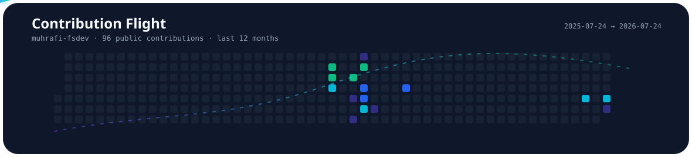

  <picture>
    <source media="(prefers-color-scheme: dark)" srcset="./assets/hero/dark-v4.svg">
    <source media="(prefers-color-scheme: light)" srcset="./assets/hero/light-v4.svg">
    
  </picture>

  Mahasiswa Telkom University dan junior full-stack developer yang membangun aplikasi web,
  personal AI, serta sistem IoT dengan fokus pada fungsi, struktur, dan pengalaman pengguna.

## Selected Projects

- **[NusaMind AI Swift](https://github.com/muhrafi-fsdev/NUSAMIND-SWIFT)** — Local-first AI assistant dengan verified retrieval, memory lokal, file analysis, dan defensive cybersecurity.
- **[RayStore Top Up](https://github.com/muhrafi-fsdev/Raystore-topup)** — Prototype top-up game dengan katalog dinamis, checkout bertahap, membership, invoice, dan PWA.
- **[Academic Organizer](https://github.com/muhrafi-fsdev/AcademicOrganizer)** — Aplikasi pengelola tugas, jadwal, dan aktivitas akademik.
- **[Private Portfolio](https://github.com/muhrafi-fsdev/PrivatePortofolio)** · **[Live Site](https://riyooprivateweb.my.id/PORTFOLIO_WEB/)** — Portfolio pribadi dan showcase project.

## Technology Stack

  

## Contribution Flight

  <picture>
    <source media="(prefers-color-scheme: dark)" srcset="./assets/heatmap/dark.svg">
    <source media="(prefers-color-scheme: light)" srcset="./assets/heatmap/light.svg">
    
  </picture>

  <a href="https://www.linkedin.com/in/rafipriyo">LinkedIn</a>
  &nbsp;·&nbsp;
  <a href="https://www.instagram.com/mhmmd_rayfy?igsh=b2RrOXk0NDN5OTNj">Instagram</a>
  &nbsp;·&nbsp;
  <a href="mailto:raymufiyo@gmail.com">Email</a>
  &nbsp;·&nbsp;
  <a href="https://riyooprivateweb.my.id/PORTFOLIO_WEB/">Portfolio</a>

