<div align="center">
  <picture>
    <source media="(prefers-color-scheme: dark)" srcset="./assets/hero/dark.svg">
    <source media="(prefers-color-scheme: light)" srcset="./assets/hero/light.svg">
    
  </picture>
</div>

<div align="center">
  <a href="https://github.com/muhrafi-fsdev"></a>
  <a href="https://www.linkedin.com/in/rafipriyo"></a>
  <a href="https://riyooprivateweb.my.id/PORTFOLIO_WEB/"></a>
  <a href="mailto:raymufiyo@gmail.com"></a>
</div>

## About Me

Saya **Muhammad Rafi Priyo**, mahasiswa Telkom University dan junior full-stack developer yang berfokus pada pengembangan website, personal AI, IoT, serta implementasi UI yang responsif.

- Membangun aplikasi web yang fungsional, ringan, dan mudah digunakan.
- Mengembangkan **NusaMind AI** sebagai eksperimen local-first AI dan software engineering.
- Mengeksplorasi backend, database, automation, defensive cybersecurity, dan IoT berbasis ESP32.
- Terbuka untuk kolaborasi project, diskusi engineering, dan pembelajaran open source.

## Current Focus

```text
Building    : Full-stack web apps, local AI tools, and practical IoT systems
Learning    : System architecture, backend reliability, testing, and security
Improving   : TypeScript, React/Next.js, Python, PHP, MySQL, and developer tooling
Principle   : Build clearly, validate honestly, improve continuously
```

## Technology Stack

<div align="center">
  
</div>

## Featured Projects

<table>
<tr>
<td width="50%" valign="top">

### NusaMind AI Swift

Local-first AI assistant yang berfokus pada respons cepat, verified retrieval, memory lokal, file analysis, dan defensive cybersecurity.

**Stack:** Next.js, TypeScript, Python, FastAPI, SQLite, Ollama

[Repository](https://github.com/muhrafi-fsdev/NUSAMIND-SWIFT)

</td>
<td width="50%" valign="top">

### RayStore Top Up

Prototype platform top-up game dengan katalog dinamis, checkout bertahap, membership, invoice lokal, tracking, dan PWA shell.

**Stack:** HTML, CSS, JavaScript, LocalStorage, PWA

[Repository](https://github.com/muhrafi-fsdev/Raystore-topup)

</td>
</tr>
<tr>
<td width="50%" valign="top">

### Academic Organizer

Aplikasi pengelola tugas, jadwal, dan aktivitas akademik untuk membantu workflow mahasiswa tetap terstruktur.

**Focus:** Task management, academic workflow, responsive UI

[Repository](https://github.com/muhrafi-fsdev/AcademicOrganizer)

</td>
<td width="50%" valign="top">

### Private Portfolio

Portfolio pribadi untuk menampilkan project, eksperimen, skill, dan perjalanan pengembangan software.

**Focus:** Personal branding, project showcase, responsive design

[Repository](https://github.com/muhrafi-fsdev/PrivatePortofolio) · [Live Portfolio](https://riyooprivateweb.my.id/PORTFOLIO_WEB/)

</td>
</tr>
</table>

## GitHub Overview

<div align="center">
  <picture>
    <source media="(prefers-color-scheme: dark)" srcset="https://github-readme-stats.vercel.app/api?username=muhrafi-fsdev&show_icons=true&hide_border=true&bg_color=00000000&title_color=22D3EE&icon_color=10B981&text_color=94A3B8">
    <source media="(prefers-color-scheme: light)" srcset="https://github-readme-stats.vercel.app/api?username=muhrafi-fsdev&show_icons=true&hide_border=true&bg_color=00000000&title_color=2563EB&icon_color=10B981&text_color=475569">
    
  </picture>
  <picture>
    <source media="(prefers-color-scheme: dark)" srcset="https://github-readme-stats.vercel.app/api/top-langs/?username=muhrafi-fsdev&layout=compact&hide_border=true&bg_color=00000000&title_color=22D3EE&text_color=94A3B8">
    <source media="(prefers-color-scheme: light)" srcset="https://github-readme-stats.vercel.app/api/top-langs/?username=muhrafi-fsdev&layout=compact&hide_border=true&bg_color=00000000&title_color=2563EB&text_color=475569">
    
  </picture>
</div>

## Contribution Flight

<div align="center">
  <picture>
    <source media="(prefers-color-scheme: dark)" srcset="./assets/heatmap/dark.svg">
    <source media="(prefers-color-scheme: light)" srcset="./assets/heatmap/light.svg">
    
  </picture>
</div>

> Jalankan `Generate-Heatmap.ps1` setelah membuat GitHub Personal Access Token agar bagian ini memakai data contribution asli. Token tidak pernah disimpan ke repository.

## Engineering Values

- **Clarity before complexity** - struktur dan alur harus dapat dijelaskan.
- **Evidence before claims** - fitur dan benchmark tidak boleh dilebih-lebihkan.
- **Security by default** - secret, password, token, dan konfigurasi sensitif tidak di-commit.
- **Progress over perfection** - project dibangun secara iteratif dengan pengujian dan dokumentasi.

## Connect

<div align="center">
  <a href="https://www.linkedin.com/in/rafipriyo">LinkedIn</a>
  &nbsp;•&nbsp;
  <a href="https://github.com/muhrafi-fsdev">GitHub</a>
  &nbsp;•&nbsp;
  <a href="https://www.instagram.com/mhmmd_rayfy?igsh=b2RrOXk0NDN5OTNj">Instagram</a>
  &nbsp;•&nbsp;
  <a href="mailto:raymufiyo@gmail.com">Email</a>
  &nbsp;•&nbsp;
  <a href="https://riyooprivateweb.my.id/PORTFOLIO_WEB/">Portfolio</a>
</div>

---

<div align="center">
  <sub>Designed and maintained by <strong>Muhammad Rafi Priyo</strong>.</sub><br>
  
</div>
